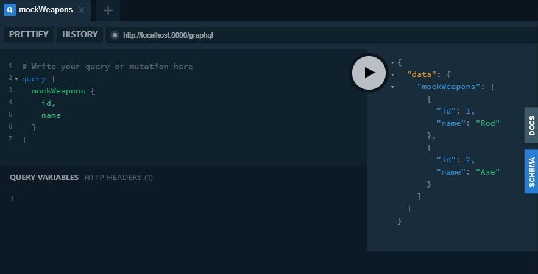
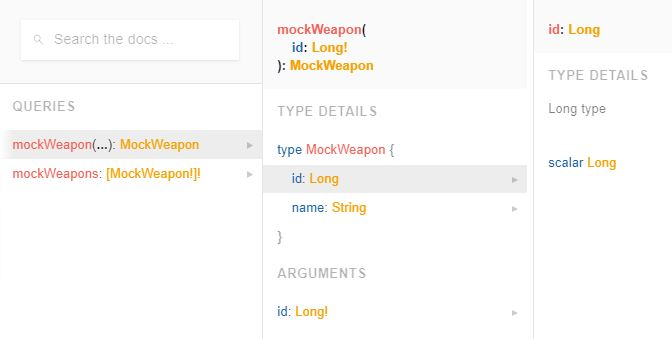
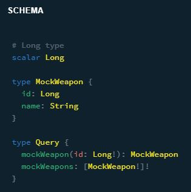
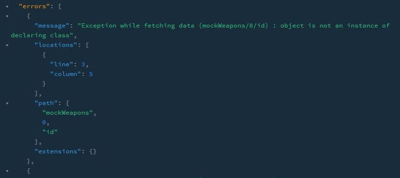
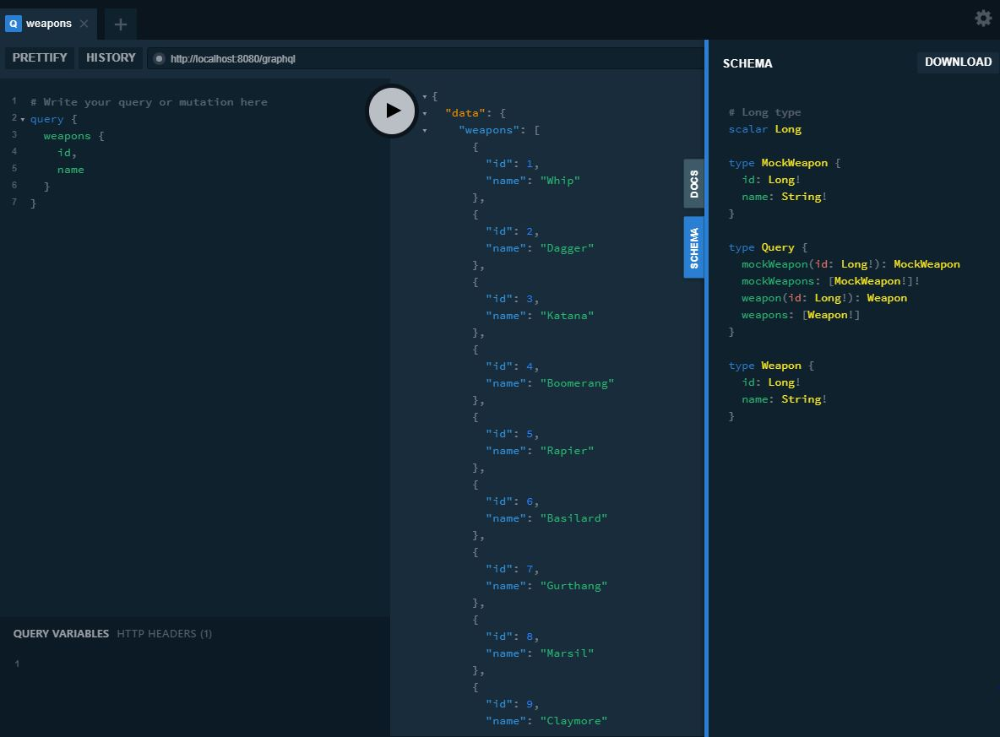
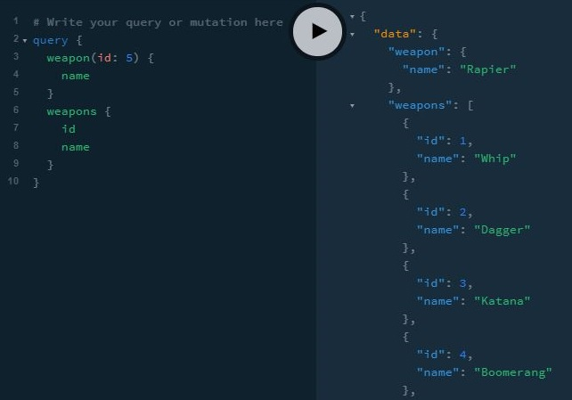

# graphql-kt-tutorial

This an example project for the Graphql-kotlin library: https://expediagroup.github.io/graphql-kotlin

Graphql-kotlin provides collection of libraries to ease the development of GraphQL applications with kotlin.

In this example we use the Spring boot autoconfiguration library graphql-kotlin-spring-server.
This library built on top of Spring Webflux, provides us with automatic schema generation, graphql-playground 
and out of the box support for kotlin coroutines.

## Configuration

This is a gradle project using the following dependencies:

``` kotlin
dependencies {
	implementation("org.springframework.boot:spring-boot-starter-data-r2dbc")
	implementation("org.springframework.boot:spring-boot-starter-webflux")
	implementation("com.fasterxml.jackson.module:jackson-module-kotlin")
	implementation("io.projectreactor.kotlin:reactor-kotlin-extensions")
	implementation("org.jetbrains.kotlin:kotlin-reflect")
	implementation("org.jetbrains.kotlin:kotlin-stdlib-jdk8")
	implementation("org.jetbrains.kotlinx:kotlinx-coroutines-reactor")
	developmentOnly("org.springframework.boot:spring-boot-devtools")
	runtimeOnly("io.r2dbc:r2dbc-h2") // h2 database r2dbc driver
	runtimeOnly("com.h2database:h2") // h2 database
//	runtimeOnly("dev.miku:r2dbc-mysql") // MySQL database r2dbc driver
//	runtimeOnly("mysql:mysql-connector-java") // MySQL database
	testImplementation("org.springframework.boot:spring-boot-starter-test")
	testImplementation("io.projectreactor:reactor-test")
	implementation("com.expediagroup", "graphql-kotlin-spring-server", "3.6.8") // graphql-kotlin
}
```

This project runs with h2 database. As reference, I also added MySQL dependencies if you
to use a regular database instead or replace with your preferred database maven dependency, and it's r2dbc driver. 
The project includes the following application.yml:

``` yaml
graphql:
  packages:
    - "com.prueba.graphkt"
```

We tell graphql-kotlin to expose schema objects in the base package com.prueba.graphkt
and configure the GraphQL web server.

H2 database needs no configuration, but if you are using MySQL, set up r2dbc with the following
configuration and adjusting the configuration for your database.

``` yaml
spring:
  r2dbc:
    initialization-mode: always
    url: r2dbc:mysql://localhost:3306/graphql-kt?useSSL=false&useUnicode=yes&characterEncoding=UTF-8&allowPublicKeyRetrieval=true&serverTimezone=UTC
    username: graphql-kt-user
    password: graphql-kt-user
```

The project uses the schema.sql, and the data.sql files in the classpath to bootstrap database data.

## Queries
Let's get to the actual code now. We start with a basic query that fetches a mock weapon database.

``` kotlin
@Component
class MockWeaponQuery(private val repository: MockWeaponRepository) : Query {

    fun mockWeapons(): List<Weapon> {
        return repository.findAll()
    }

    fun mockWeapon(id: Long): Weapon? {
        return repository.findById(id)
    }
}
```

First we implement the query interface to create the entry point for our graphql server. Graphql-kotlin
would pick the methods in our class and generate the schema for us. In this first example we have
a find all function witch returns all the weapons, and a find by id function witch receives the weapon
id as parameter.

Our first repository is simple, a set of mock data.

``` kotlin
@Component
class MockWeaponRepository {
    fun findAll(): List<MockWeapon> = listOf(MockWeapon(1, "Rod"),MockWeapon(2, "Axe"))

    fun findById(id: Long): MockWeapon? = listOf(MockWeapon(1, "Rod"))
            .find { id == it.id }
}
```

Finally, we have the data class.

``` kotlin
data class MockWeapon(
        val id: Long,
        val name: String,
)
```

Now we start the application and graphql-kotlin automatically creates the schema and the playground
for us. Let's head up to localhost:8080/playground and try some queries.



We see at the left, the query to retrieve our mock weapons. We are asking our graphql server to
fetch the id and the name of the weapon. There's a play button in the mid section, click it to make the query.
At the right section we see the actual result of the query and two tabs. The first tab is the documentation
of the API and the second is the schema generated by graphql-kotlin. If we click the docs tab, we see a nice
autogenerated API documentation.



The second tab contains our schema.



As we see, graphql-kotlin has generated the graphql schema for us with just defining a query class, and a data class.

Now let's play around a little. I'm going to return a different type, List<Weapon> in our mockWeapons query to see what happens.
This will generate an error.

``` kotlin
class MockWeaponQuery(private val repository: MockWeaponRepository) : Query {

    fun mockWeapons(): List<Weapon> {
        return repository.findAll()
    }
...
```

Despite having a correct source code, we get the below error.



If we put a query returning a different in our mock query, graphql-kotlin
would throw a reflection error, as this library uses kotlin reflection to generate the schema matching
the query name with the return type name.

Finally, we revert our source code to fix the error.

``` kotlin
class MockWeaponQuery(private val repository: MockWeaponRepository) : Query {

    fun mockWeapons(): List<MockWeapon> {
        return repository.findAll()
    }
...
```
Now we saw the basics of graphql-kotlin, we are going to a more realistic example using the actual
Spring Webflux this library runs on.

## Webflux and coroutines
In this section we are working with a more realistic setup, fetching data from the database using
the Webflux ReactiveCrudRepository.

``` kotlin
@Repository
interface WeaponRepository : ReactiveCrudRepository<Weapon, Long> {
}
```

Our data class is the same as the mock version.

``` kotlin
import org.springframework.data.annotation.Id

data class Weapon(
        @Id
        val id: Long,
        val name: String,
)
```

Notice the @Id annotation needed for Spring Data in order to map our data classes to database records.
Now let's see the query class.

``` kotlin
@Component
class WeaponQuery(private val weaponRepository: WeaponRepository) : Query {

    suspend fun weapons(): MutableList<Weapon>? {
        return weaponRepository.findAll().collectList().awaitFirst()
    }

    suspend fun weapon(id: Long): Weapon? {
        return weaponRepository.findById(id).awaitSingle()
    }
}
```

We use the Webflux ReactiveCrudRepository findAll and findById stock methods to fetch our weapons, then we use the
Reactor's kotlin coroutines api to transform the resulting Flux to a suspend function. Kotlin coroutines
have built-in support for graphql-kotlin-schema-generator, if your are using other asynchronous models like 
RxJava and Reactor, you have to specify your own data fetcher. Form more info about other asynchronous models,
follow this link https://expediagroup.github.io/graphql-kotlin/docs/schema-generator/execution/async-models.

Now we have finish our graphql API, let's try some queries on graphql playground.



We are querying now data from our database and have the full schema. Let's try some more queries.



There you go, a fully working graphql server easily implemented with Spring boot and graphql-kotlin.

We have a lot of flexibility for defining our queries with this setup, for example, we can arrange our application
in three layer architecture. For a tree layer architecture setup, we can move the controller logic to a service.

``` kotlin
@Service
class WeaponService(private var weaponRepository: WeaponRepository) {
    fun findAll(): Mono<List<Weapon>> {
        return weaponRepository.findAll().collectList()
    }

    fun findById(id: Long): Mono<Weapon> {
        return weaponRepository.findById(id)
    }
}
```

Our query class be the following.

``` kotlin
@Component
class WeaponQuery(private val weaponService: WeaponService) : Query {

    suspend fun weapons(): List<Weapon>? {
        return weaponService.findAll().awaitFirst()
    }

    suspend fun weapon(id: Long): Weapon? {
        return weaponService.findById(id).awaitSingle()
    }
}
```

The application is still working as expected. That's it for this tutorial.

## Conclusions
We created a graphql server with graphql-kotlin. The implementation was easy as we only have
to provide the data with the help of kotlin coroutines. We can have Spring boot application as
complex as we need and allow our clients to decide on how they fetch the API. As long as the query
name matches the resulting entity name. The next steps is learning how to make paginated queries
with the help of Spring data, avoid DDOS attacks because of recursive queries and to secure our 
API with Spring security.